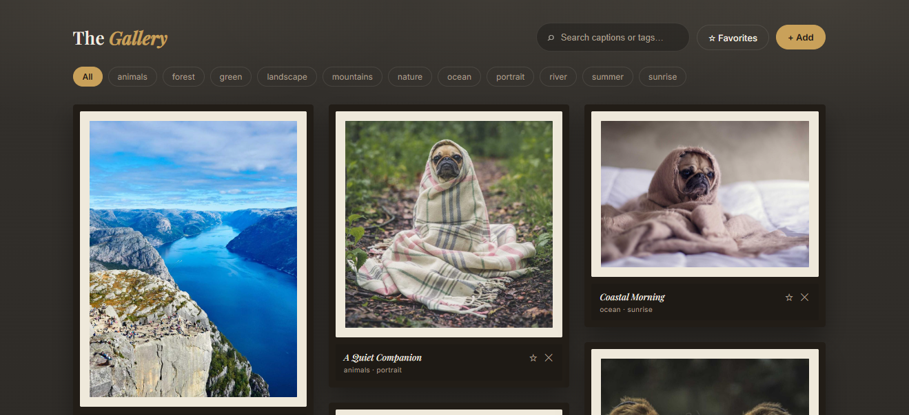

# 🖼️ The Gallery — Curated Visual Exhibition & Media Management Studio

[](https://github.com/)
[](https://opensource.org/licenses/MIT)
[](https://github.com/)

> **"A modern digital art hall for visual curation and image discovery."**

**The Gallery** is a responsive, client-side web application designed for organizing, discovering, and presenting photography collections. Built with native web standards, it features dynamic tag-based filtering, real-time keyword/caption search indexing, custom interactive favorite bookmarking (`☆ Favorites`), image uploading (`+ Add`), and a fluid polaroid-framed grid layout.

[Explore Live Workspace](https://yourusername.github.io/the-gallery) • [Report a Bug](https://github.com/yourusername/the-gallery/issues) • [Request Feature](https://github.com/yourusername/the-gallery/issues)

---

## 📸 Interface Preview & Gallery

### Exhibition Grid & Interactive Tag Matrix
<!-- Replace this placeholder URL with your real cropped screenshot once uploaded to GitHub -->


### 🎥 Interactive Exhibition Walkthrough
> **Watch The Gallery in action:** Click the workspace preview below to see dynamic tag filtering, instant search indexing, modal image preview lightbox, dynamic upload appending, and favorite bookmark persistence.

[](https://github.com/yourusername/the-gallery "Watch Walkthrough")

---

## ✨ Core Engineering & Feature Set

* **🏷️ Multi-Tag Filtering System:** Instant category filtering across dynamically generated pills including *animals*, *forest*, *green*, *landscape*, *mountains*, *nature*, *ocean*, *portrait*, *river*, *summer*, and *sunrise*.
* **🔍 Real-Time Caption & Tag Search:** Instant filtering powered by continuous JavaScript input listeners scanning image metadata (titles, captions, and associated tag arrays).
* **🖼️ Vintage Polaroid Styling:** Cream-matted polaroid image containers with subtle elevated shadows, caption typography, tag metadata, and quick action nodes.
* **⭐ Persistent Favorites Gallery (`☆ Favorites`):** One-click favoriting engine that flags preferred photographs and isolates them into a dedicated saved collection view using `localStorage`.
* **➕ Dynamic Image Upload (`+ Add`):** Client-side image upload handler allowing users to dynamically extend the exhibition grid with custom image URLs or File API inputs.
* **📱 Responsive Grid Layout:** Fluid CSS Grid / Flexbox architecture ensuring seamless display across mobile, tablet, and widescreen desktop monitors.

---

## 🛠 Tech Stack Matrix

| Module | Selected Technologies | Architectural Mandate |
| :--- | :--- | :--- |
| **Structure** | HTML5 | Accessible search inputs, tag filter bar, image card containers, and upload modals |
| **Styling** | CSS3 Grid / Flexbox | Custom sepia color variables, polaroid frame geometry, fluid responsive card layouts |
| **Engine** | Vanilla JavaScript | Real-time DOM filtering algorithms, image input parsing, `localStorage` bookmark persistence |

---

## 📦 Rapid Local Setup

### 1. Repository Clone
```bash
git clone [https://github.com/yourusername/the-gallery.git](https://github.com/yourusername/the-gallery.git)
cd the-gallery
